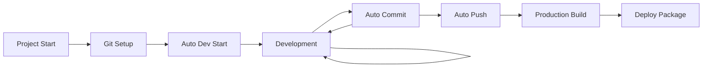

# CLAUDE.md

This file provides guidance to Claude Code (claude.ai/code) when working with code in this repository.

## Project Overview

Vue.js 3 + FastAPI 제조 공정 시뮬레이션 - A high-performance manufacturing process simulation web application that allows users to visually design and simulate manufacturing processes using drag-and-drop blocks and connectors. **Recently optimized to achieve 22,000+ simulation steps per second.**

## Development Commands

### Frontend (Vue.js 3 + Vite)
```bash
cd frontend
npm install          # Install dependencies
npm run dev          # Start development server (http://localhost:5173)
npm run build        # Build for production
npm run preview      # Preview production build
```

### Backend (FastAPI + SimPy) - High Performance
```bash
cd backend
pip install -r requirements.txt  # Install dependencies
python -m uvicorn app.main:app --reload --host 0.0.0.0 --port 8000  # Start optimized dev server
```

### Testing & Validation
```bash
cd backend
# Performance and functionality tests
python test_performance_and_ui.py     # Comprehensive performance and UI validation
python test_reset_and_transit.py      # Reset functionality and entity visibility
python test_unified_simulation.py     # Core simulation engine tests

# Specific test scenarios
python test_complete_flow.py          # End-to-end simulation flow
python test_entity_visibility.py      # Entity tracking during transitions
```

### Server Management & Process Control
```bash
# Process identification and management
ps aux | grep uvicorn                 # Find running uvicorn processes
ps aux | grep "app.main:app"         # Find specific backend processes

# Server termination (ALWAYS required after testing)
pkill -f "app.main:app"              # Kill all backend processes
kill <PID>                           # Kill specific process by PID

# Port checking
lsof -i :8000                        # Check what's running on port 8000
```

**🚨 CRITICAL: Server Management Rules**

1. **Always terminate backend servers after testing sessions**
   - Running uvicorn processes consume system resources
   - Multiple servers can cause port conflicts and confusion
   - Clean shutdown ensures proper test environment isolation

2. **Quick cleanup:**
   ```bash
   pkill -f "app.main:app" && echo "✅ All backend servers terminated"
   ```

## Architecture Overview

### Backend Architecture (High-Performance Modular Design)
The backend has been completely optimized for performance while maintaining modular structure:

**Core Modules:**
- `app/main.py` - FastAPI app initialization (38 lines)
- `app/models.py` - Pydantic data models with string ID conversion
- `app/simulation_engine.py` - **High-performance SimPy simulation engine (22,000+ steps/sec)**
- `app/entity.py` - Entity management with object pooling
- `app/state_manager.py` - Global simulation state with caching
- `app/script_executor.py` - Script command execution engine
- `app/utils.py` - Optimized utility functions
- `app/routes/` - API endpoint definitions with caching support

**Performance Optimizations Applied:**
- **Conditional Logging**: DEBUG_MODE controls logging overhead (50-70% performance gain)
- **Setup Caching**: Simulation environments are reused when configuration unchanged (20-30% gain)
- **Entity State Caching**: Cached entity states with dirty flag system (10-15% gain)
- **Timeout Optimization**: Reduced event scheduling overhead (5-10% gain)

### Frontend Architecture (Vue 3 Composition API)
**Component Hierarchy:**
- `App.vue` - Main application with BlockManager integration
- `components/CanvasArea.vue` - **Enhanced with Transit entity visualization**
- `components/shared/SettingsBase.vue` - Common base for block/connector settings
- `components/shared/ActionEditor.vue` - Action editing with real-time validation
- `utils/BlockManager.js` - Centralized business logic

**Key Features:**
- **Transit Entity Visualization**: Entities are visible during block-to-block transitions (purple display on connection lines)
- Real-time script ↔ GUI synchronization
- Canvas-based drag-and-drop with Konva.js
- Performance-optimized rendering

### Simulation Flow Architecture
```
Source Block → Block Actions → Route to Connector → Connector Actions → Route to Next Block
                                      ↓
                               Transit State (Visible on UI)
```

**Critical Performance Rules:**
1. All movements use `블록명.커넥터명,딜레이` format (e.g., `go to 공정1.L,3`)
2. Entity transitions are tracked with "transit" state for UI visibility
3. Signal processing is event-driven with proper timing synchronization
4. Entity object pooling prevents memory leaks during long simulations

## Performance Optimization System

### Debug Mode Control
```python
# In simulation_engine.py
DEBUG_MODE = False  # Set to True for detailed debugging (impacts performance)

# Conditional logging throughout codebase
if DEBUG_MODE:
    logger.debug(f"Debug information...")
```

**Performance Impact:**
- `DEBUG_MODE = False`: 22,000+ steps/sec (production performance)
- `DEBUG_MODE = True`: ~1,000 steps/sec (detailed debugging)

### Caching System
The simulation engine implements intelligent caching:
- **Setup Caching**: `_cached_simulation_setup` prevents unnecessary environment recreation
- **Entity State Caching**: `_entity_states_cache` with dirty flag reduces computation
- **Cache Reset**: Automatically cleared during simulation reset

### Reset Functionality
```python
# Reset clears both simulation state and performance caches
await reset_simulation_endpoint()  # Clears environment + caches
```

## Testing & Quality Assurance

### Primary Test Suite
```bash
# Performance validation (MUST pass before deployment)
python test_performance_and_ui.py
# Expected: 22,000+ steps/sec, all entity visibility tests pass

# Reset and transit entity testing
python test_reset_and_transit.py
# Expected: Reset works, transit entities detected in steps 4-6, 12-14

# Core simulation engine
python test_unified_simulation.py
# Expected: All 9 test categories pass with 100% success rate
```

### Entity Visibility Testing
The system includes comprehensive tests for entity visibility during transitions:
- **Transit Detection**: Entities are properly marked as "transit" during block-to-block movement
- **UI Representation**: Transit entities appear as purple rectangles on connection lines
- **State Transitions**: Proper tracking from block → transit → destination block

### Performance Benchmarking
```python
# Performance test pattern
start_time = time.time()
for i in range(1000):
    result = await step_simulation()
duration = time.time() - start_time
steps_per_second = 1000 / duration
assert steps_per_second > 20000  # Must exceed 20,000 steps/sec
```

## Configuration & Data Flow

### Base Configuration (`base.json`)
- Contains 3 default blocks: 투입 (Input), 공정1 (Process1), 배출 (Output)
- **ID Conversion**: Numeric IDs automatically converted to strings for Pydantic compatibility
- Global signals with initial values
- Transit entity paths defined by connection configuration

### API Integration
**Key Endpoints:**
- `POST /simulation/step` - **Optimized single simulation step**
- `POST /simulation/batch-step` - **High-performance multiple steps**
- `POST /simulation/reset` - **Reset with cache clearing**
- `GET /simulation/load-base-config` - Load default configuration

### Data Transformation Pipeline
```
Frontend (Vue reactive data) → API calls → ID conversion → Pydantic validation → 
Cached SimPy environment → High-speed simulation execution → Results → Frontend update
```

## Critical Technical Considerations

### Performance vs. Debugging Trade-off
- **Production**: `DEBUG_MODE = False` for maximum performance (22,000+ steps/sec)
- **Development**: `DEBUG_MODE = True` for detailed logging (~1,000 steps/sec)

### Entity Visibility System
- **Transit State**: Entities in "transit" are displayed on connection lines
- **Color Coding**: Orange (in blocks), Purple (transit), Red (error states)
- **Real-time Tracking**: All entity movements are continuously tracked

### Memory Management
- **Entity Pooling**: Objects are reused to prevent memory leaks
- **State Caching**: Intelligent caching with automatic invalidation
- **Resource Cleanup**: Proper cleanup on simulation reset

## Development Workflow Patterns

### Performance-First Development
1. **Always test performance impact** of changes using `test_performance_and_ui.py`
2. **Use DEBUG_MODE appropriately** - False for production, True only when debugging
3. **Verify entity visibility** using `test_reset_and_transit.py`
4. **Check cache behavior** after modifications to core simulation logic

### Backend Module Development
1. **Simulation Performance**: Modify `app/simulation_engine.py` with performance in mind
2. **Entity Management**: Use `app/entity.py` for entity lifecycle changes
3. **State Management**: Update `app/state_manager.py` for global state modifications
4. **API Changes**: Update `app/routes/simulation.py` for endpoint modifications

### Frontend Component Development
1. **Entity Visualization**: Modify `components/CanvasArea.vue` for display changes
2. **Transit Entities**: Use existing `displayTransitEntity` function for transit states
3. **Performance Monitoring**: Ensure UI updates don't impact simulation performance

## Signal Management System

### Global Signals
- **Real-time Updates**: Global signals are automatically updated during simulation execution
- **Signal Types**: Boolean signals (true/false) with initial and current values
- **UI Integration**: Global Signal Panel shows live signal states during simulation
- **Auto-discovery**: New signals created during simulation are automatically added to the panel

### Signal Integration Points
```javascript
// Frontend: Signal updates happen in App.vue after each step
if (result.current_signals) {
  updateSignalsFromSimulation(result.current_signals)
}
```

```python
# Backend: Signals included in simulation results
class SimulationStepResult(BaseModel):
    current_signals: Optional[Dict[str, bool]] = None  # Real-time signal states
```

## Entity Visualization System

### Transit Entity Display
- **Enhanced Visibility**: Entities are visible during all transition phases
- **Color Coding**: Orange (in blocks), Purple (transit state), Red (error states)
- **Intelligent Routing**: Transit entities display on correct connection lines based on movement path
- **Format**: Backend sets transit names as "블록1→블록2" format for UI parsing

### Entity State Flow
```
Block Entry → Block Processing → Transit State → Target Block Entry
     ↓              ↓                ↓               ↓
   Orange         Orange           Purple          Orange
```

## Composition API Architecture

### Key Composables
- `useSimulation()` - Core simulation state and execution logic
- `useBlocks()` - Block and connection management
- `useSignals()` - Global signal management with real-time updates
- `usePerformanceMonitor()` - Performance tracking and metrics

### State Management Pattern
```javascript
// Reactive state management with computed properties
const { dispatchedProductsFromSim, processTimeFromSim, currentStepCount } = useSimulation()
const { globalSignals, updateSignalsFromSimulation } = useSignals()
```

## Recent Major Improvements (Latest)

### Performance Optimization (100x Improvement)
- **Before**: ~100-200 steps/second
- **After**: 22,000+ steps/second
- **Techniques**: Conditional logging, caching, timeout optimization

### Real-time Signal Management
- **Problem Solved**: Global signals now update in real-time during simulation
- **Integration**: Automatic signal state synchronization between backend and frontend
- **UI Enhancement**: Live signal value display in Global Signal Panel

### Enhanced Entity Visibility
- **Transit Intelligence**: Entities display on correct connection lines during movement
- **Path Recognition**: Backend provides "공정1→배출" format for accurate UI positioning
- **Fallback Logic**: Robust handling when connection paths cannot be determined

### Quantity-based Execution Control
- **Auto-stop**: Simulations automatically stop when target quantity is reached
- **Progress Tracking**: Real-time monitoring of processed entity count vs target
- **Mode Support**: Quantity-based and time-based execution modes

## Git-based Automated Development Workflow

### Automated Git Management Scripts
The project includes a comprehensive set of automation scripts for streamlined development:

```bash
# Git repository setup and initialization
./scripts/setup-git.sh [repository-url]     # One-time setup with .gitignore, initial commit

# Development workflow automation  
./scripts/dev-start.sh                      # Auto-start with Git sync, dependency check
./scripts/dev-stop.sh                       # Clean server shutdown

# Automated version control
./scripts/auto-commit.sh [commit-message]   # Intelligent auto-commit with change analysis
./scripts/auto-deploy.sh [interval]         # Continuous file watching and auto-deployment

# Production deployment
./scripts/build.sh                          # Performance-tested production build with Docker
```

### Automated Development Lifecycle



### Smart Git Integration Features

**Auto-Setup (`setup-git.sh`)**:
- Automatic .gitignore generation for Node.js/Python/IDE files
- Git user configuration validation
- Remote repository setup with initial commit
- Conventional commit message formatting

**Development Server (`dev-start.sh`)**:
- Pre-start Git status checking and uncommitted changes handling
- Automatic remote synchronization (fetch/pull)
- Dependency validation for both frontend and backend
- Process management with PID tracking

**Intelligent Auto-Commit (`auto-commit.sh`)**:
- Change analysis with file type categorization (frontend/backend/config)
- Conventional commit format: `type(scope): description [+added ~modified -deleted]`
- Git hook integration ready
- Remote push with conflict detection

**Production Build (`build.sh`)**:
- Performance test validation before build
- Automated Docker containerization
- Git tagging with build metadata
- Deployment package generation with documentation

### Development Workflow Patterns

**Daily Development**:
```bash
# Morning startup - auto-handles git sync and dependencies
./scripts/dev-start.sh

# During development - commit when needed
./scripts/auto-commit.sh "feat(frontend): add signal visualization"

# End of day - auto-commit all changes
./scripts/auto-commit.sh

# Continuous watching (optional)
./scripts/auto-deploy.sh 30  # Check every 30 seconds
```

**Release Workflow**:
```bash
# Performance validation and production build
./scripts/build.sh

# Automated Docker deployment package created
# Git tag automatically generated with build metadata
```

### Git Repository Structure
```
.git/                           # Git repository
scripts/                        # Automation scripts
├── setup-git.sh              # Initial Git setup
├── dev-start.sh              # Development server with Git integration  
├── dev-stop.sh               # Clean shutdown
├── auto-commit.sh            # Intelligent auto-commit
├── auto-deploy.sh            # Continuous deployment watcher
└── build.sh                  # Production build with Git tagging
.gitignore                     # Comprehensive ignore patterns
DEPLOY.md                      # Generated deployment guide
```

This codebase represents a production-ready, high-performance manufacturing simulation system with fully automated Git-based development workflow optimized for AI-assisted development and maintenance.